# Roofline: An Insightful Visual Performance Model for Floating-Poperational intensitynt Programs and Multicore Architectures
作者：Samuel Williams, Andrew Waterman, David Patterson

主题：本文提出了一个简单、可视化的性能模型，用来判断浮点程序在多核架构上的性能瓶颈到底来自计算能力不足还是来自内存带宽不足。

---

## 一、背景
这篇文章的核心目标，是提出一个简单直观的性能分析模型，帮助程序员、编译器设计者和体系结构研究者判断程序性能瓶颈，并进一步指导优化方向。

论文开头首先讨论了一个大的体系结构背景：在单核处理器时代，主流处理器设计有比较一致的“传统范式”，例如 cache、流水线、超标量、乱序执行等。但进入多核时代以后，处理器架构开始明显分化。有些芯片采用少量复杂核心，有些采用大量简单核心，有些依赖多线程等。这种架构多样性增加了程序优化难度。作者认为，在这种背景下，一个容易理解、能够提供优化指导的性能模型非常有价值。

文中说：“A model need not be perfect, just insightful.”也就是说，模型不一定要完美预测每个细节，但必须能提供有用洞察。

本文的出发点不是做一个复杂到能精确预测每个程序运行时间的模拟器，而是提供一个“看图就能判断瓶颈”的分析工具。对于做 AI 加速器研究也一样，很多时候我们不只是想知道程序跑了多少秒，还想知道：到底是 MAC 阵列不够，还是数据搬运太慢，还是数据复用不够。

---

## 二、问题

本文要解决的问题可以概括为：给定一个程序和一台多核机器，如何快速判断程序性能受限于计算峰值，还是受限于内存带宽？

作者在第 3 节提出：“off-chip memory bandwidth will often be the constraining resource”。传统上我们评价处理器经常看峰值 FLOP/s，比如某个 CPU 或 GPU 有多少 GFLOPS、多少 TOPS。但作者指出，对于很多科学计算 kernel 来说，即使硬件峰值计算能力很高，程序也可能跑不满。原因是每次从 DRAM 搬来的数据只能产生很少计算，导致计算单元经常等待数据。

这也可以类比到ai加速器中。比如大矩阵乘法 GEMM 的数据复用很高，可能接近 compute-bound；但稀疏矩阵计算等算子通常计算量少、读写数据多，更容易 memory-bound。

---

## 三、相关工作

论文第 2 节介绍了已有的性能模型。作者主要提到两类：stochastic analytical models 和 statistical performance models。前者是随机解析模型，常用概率、排队论、随机过程等方法对多处理器系统建模；后者是统计性能模型，通常通过大量实验数据拟合程序性能。这些模型有一个共同优点：在某些情况下可以比较准确地预测程序性能。但作者指出，它们往往有两个问题：第一，不一定能直观告诉我们应该怎么优化；第二，对非专家来说使用门槛较高。

因此，作者转向一种更简单的分析方法：**bound and bottleneck analysis**，也就是上界与瓶颈分析。它不追求精确预测所有性能细节，而是找出影响性能的主要上限和瓶颈。论文中还提到 Amdahl’s Law 作为这类思想的典型例子。Amdahl 定律不是模拟器，但它能清楚告诉我们：并行加速受串行部分限制。
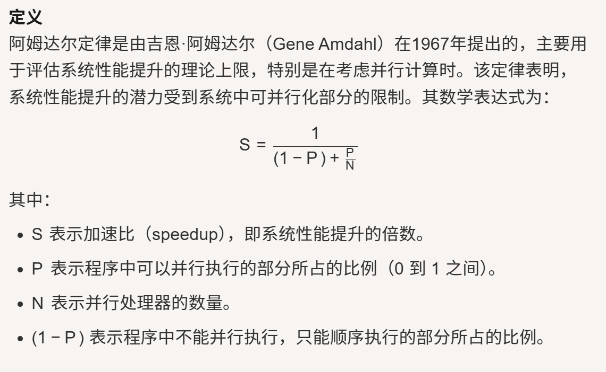

Roofline 模型也属于这种思想。它不告诉人们程序一定跑到多少GFLOP/s，而是说：在当前 operational intensity 下，性能最多能到哪里，瓶颈大概在哪一侧。

---

## 四、作者发现的不足

作者认为已有模型主要有三个不足。

第一，已有复杂模型虽然可能预测准确，但不够直观。比如一个随机解析模型可能告诉我们某程序预计性能是多少，但不一定告诉我们下一步该优化 cache、SIMD、内存亲和性还是预取。

第二，传统的 arithmetic intensity 或 machine balance 概念不完全适合作者想分析的问题。作者强调，他们关心的是 cache 过滤之后真正进入 DRAM 的流量，而不是处理器和 cache 之间的流量。因此他们提出 **operational intensity**，即每访问 1 Byte DRAM 数据能完成多少操作。这个定义使得 cache 优化、内存优化都能反映到模型中。

arithmetic intensity是算数强度，关注的是 processor 和 cache 之间的数据流量；machine balance 是处理器峰值算力和内存带宽的比值；而 operational intensity 则是程序每访问 1 Byte DRAM 数据能完成多少操作。这个定义更适合分析 DRAM 层面的性能瓶颈。

第三，只看 peak FLOP/s 会误导架构设计。一个处理器计算峰值越高，并不代表实际程序越容易跑满。如果计算峰值提升了，但内存带宽没有同步提升，那么 ridge poperational intensitynt 会向右移动，意味着程序必须有更高的数据复用能力才能达到峰值。

---

## 五、创新点

本文的创新点主要有四个。

第一，提出了一个二维可视化性能模型 Roofline。它把三个关键量统一到一张图里：纵轴是 attainable performance，横轴是 operational intensity，图中的水平线表示计算峰值，斜线表示内存带宽限制。核心公式是：

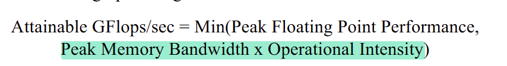

这个公式是全文的数学基础。

第二，提出用ridge poperational intensitynt衡量机器是否平衡。ridge poperational intensitynt 是水平计算屋顶和斜向内存屋顶的交点，其横坐标为：

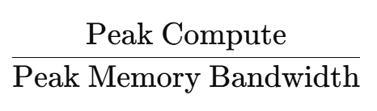

它表示程序至少需要多高的 operational intensity，才能达到峰值计算性能。ridge poperational intensitynt 越靠右，说明越难跑满机器峰值。

第三，在 Roofline 上加入ceilings。基础 Roofline 只能告诉我们理论最高上限，但如果程序远低于 Roofline，仍然需要知道具体优化方向。作者把某些优化没做时形成的较低性能上限称为 ceilings，例如没有 SIMD、ILP 不足、没有prefetch等。这样模型不只是判断 memory-bound 或 compute-bound，还能进一步指导优化顺序。

第四，把经典的3Cs cache model和 operational intensity 联系起来。作者指出 operational intensity 并不是完全固定的，cache miss 会改变 DRAM traffic，进而改变 operational intensity

Cache缺失(miss)的3C定理:
1. Compulsory , 第一次访问失效
2. Capcity, 由于cache满引发的miss
3. Conflict, 有多个数据映射到cache同一个位置

---

## 六、作者具体详细的设计

### 6.1 基础 Roofline 模型

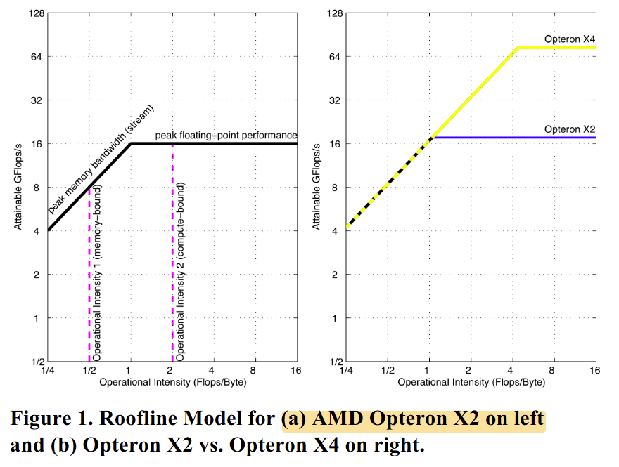

Figure 1a 是 AMD Opteron X2 的 Roofline 模型。原文给出这台机器的双精度浮点峰值为 17.6 GFLOP/s，峰值内存带宽为 15 GB/s。图中横轴是 operational intensity，单位是 Flops/Byte；纵轴是 可以达到的运算强度，单位是 GFLOP/s；坐标采用 log-log scale。

图中有两条核心线：

第一条是水平线，它表示硬件计算峰值。无论程序数据复用多好，性能都不能超过这条线。

第二条是斜线，它表示在给定 operational intensity 下，内存带宽最多能支撑多少计算性能,表示为 带宽 x operational intensity。

因此最终性能上限是两者取较小值：

以 Figure 1a 为例，如果 kernel 的 operational intensity = 1，那么内存带宽最多支撑15GFLOP/s，低于 17.6 GFLOP/s 的计算峰值，因此它是 memory-bound。如果 operational intensity = 2，那么内存可以支撑30GFLOP/s，超过计算峰值，因此最终受 17.6 GFLOP/s 限制，是 compute-bound。

Figure 1b 比较了 Opteron X2 和 Opteron X4。X4 计算峰值比 X2 大幅提升，但 DRAM 通道基本相同，因此内存带宽没有同步增加。结果是 ridge poperational intensitynt 从约 1.0 右移到 4.4。这说明只提高算力、不提高内存带宽，会让程序更难达到峰值性能。

---

### 6.2 在 Roofline 中加入 Ceilings

Figure 2 是本文的第二个核心设计。作者提出一个问题：如果程序远低于 Roofline应该做什么优化。为了解决这个问题，作者加入了 ceilings，也就是不同优化缺失时形成的性能天花板。

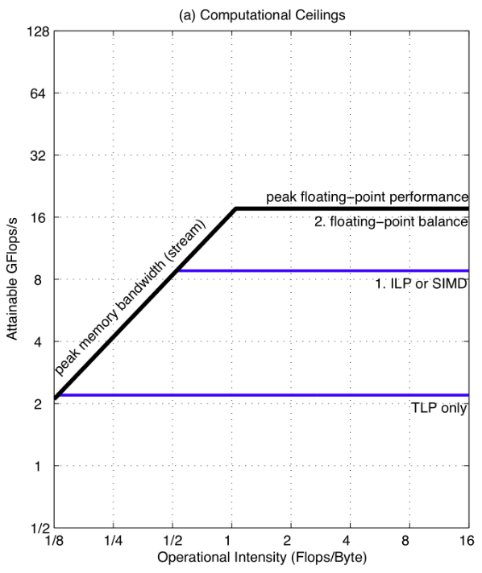

Figure 2a 展示计算瓶颈的ceilings。作者认为对 Opteron X2 来说，减少计算瓶颈主要有3个优化方向：

1. Improve instruction level parallelism (ILP) and apply SIMD，即提高指令级并行并使用SIMD（Single Instruction Multiple Data）单指令多数据，即一条指令对多个数据元素执行相同操作。
2. Balance floating-poperational intensitynt operation mix，即平衡浮点操作类型，例如让加法和乘法比例更匹配。
3. TLP：线程级并行，多个线程或多个 core 同时执行。

图中显示，如果缺少 ILP 或 SIMD 优化，计算 ceiling 约为 2.2 GFLOP/s；如果浮点操作 mix 不平衡，ceiling 约为 8.8 GFLOP/s。

Figure 2b 展示内存带宽ceilings。作者给出三类内存优化：

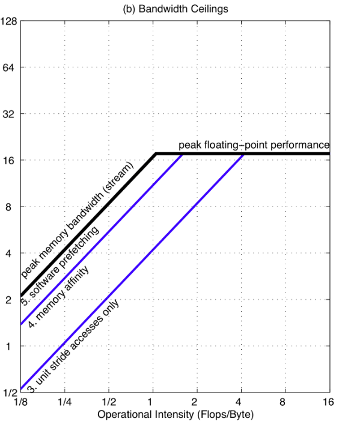

1. unit stride accesses，重构循环，让访存变成单位步长的连续访问；
2. memory affinity，保证内存亲和性，让线程尽量访问本处理器附近的 DRAM；
3. software prefetching，使用软件预取，提前把未来要用的数据取入cache。

图中内存带宽 ceilings 分别为：没有 software prefetching 时 11 GB/s；没有 memory affinity 时 4.8 GB/s；只有 unit-stride 优化时 2.7 GB/s。这些数不是公式推出来的，而是作者在对应机器上通过实验测出来的有效带宽。

Figure 2c 把计算 ceilings 和内存 ceilings 合在一张图中。

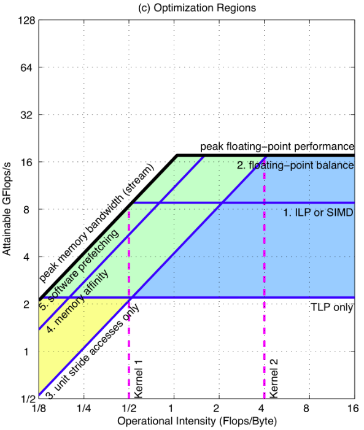

它的意义是：kernel 的 operational intensity 决定它落在哪个优化区域。如果落在左下角黄色区域，主要应该做内存优化；如果落在右侧蓝色区域，主要应该做计算优化；如果落在中间绿色区域，则两类优化都可能重要。

---

### 6.3 3Cs 与 operational intensity 的联系

作者指出，前面虽然把 operational intensity 当成固定值，但实际上 operational intensity 会受 cache 行为影响。因为 operational intensity 的分母是 DRAM traffic，如果 cache 优化减少了访问 DRAM 的次数，operational intensity 就会上升。

流程是cache miss 增加，DRAM traffic 增加，Operational Intensity 下降，Roofline 点向左移动，更容易 memory-bound

3Cs model 包括三类 cache miss：

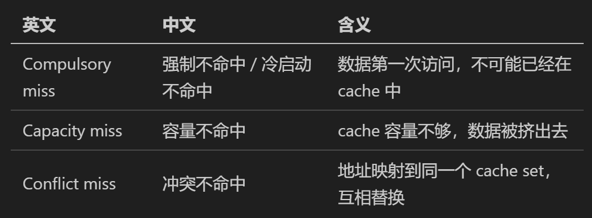

作者指出，compulsory misses 决定最低内存流量，也就决定最高可能 operational intensity；而 conflict 和 capacity misses 会增加额外 DRAM 流量，从而降低 operational intensity。因此应该减少不必要 DRAM traffic，从而提高operational intensity，再做其他优化。

---

## 七、怎么通过设计解决问题

Roofline 通过三个层次解决性能分析问题。

第一层，基础 Roofline 判断大方向。通过比较 kernel 的 operational intensity 和 ridge，可以判断它是 memory-bound 还是 compute-bound：

第二层，ceilings 指导具体优化。如果程序低于理论 Roofline，ceilings 可以告诉我们是因为 SIMD 没做好、ILP 不足、浮点操作不平衡、访存不连续、内存亲和性差，还是缺少软件预取。这样模型不只是描述问题，还能给出优化顺序。

第三层，通过 3Cs 改变 operational intensity。Roofline 不把 operational intensity 看成不可改变的常数，而是允许通过减少 DRAM traffic 来提高 operational intensity。例如可以减少 capacity/conflict miss，让 kernel 的点在图中向右移动，从而有从 memory-bound 区域进入 compute-bound 区域。

---

## 八、为了证明方案有效，实验设计是怎样的

作者设计实验时，选了四台差异很大的多核机器和四个代表性 floating-poperational intensitynt kernels。

### 8.1 实验平台：四种多核计算机

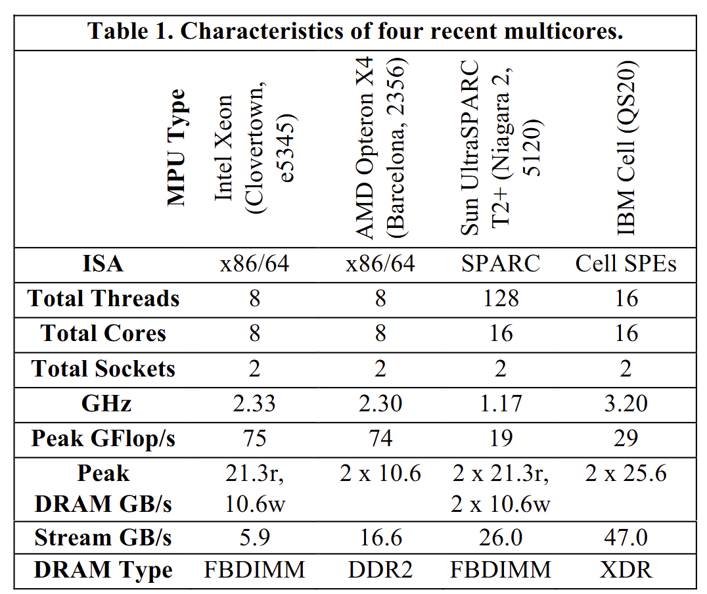

作者这样选，是为了覆盖不同体系结构特征。Xeon 代表传统复杂核心但内存系统受前端总线限制；Opteron X4 代表片上内存控制器；T2+ 代表多线程高带宽设计；Cell 代表显式 local store 和 DMA 的异构设计。

### 8.2 实验 kernel：四个 Seven Dwarfs 代表

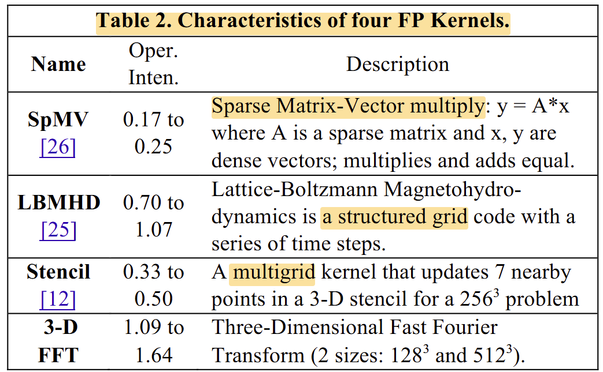

作者没有直接使用一套完整的benchmark，而是选了四个代表性 kernel：

1. SpMV：稀疏矩阵向量乘，不规则访存，乘加天然平衡
2. LBMHD：Lattice-Boltzmann 磁流体力学，结构化网格时间步计算
3. Stencil：3D stencil，用中心点和邻居点更新网格
4. 3-D FFT：三维快速傅里叶变换，两个大小

这些 kernel 的 operational intensity 从很低到中等，访存规律和计算规律也不同，因此适合验证 Roofline 是否能解释不同程序的性能行为。作者还说明这些 kernel 有足够并行性，可以利用全部核心和线程，并保持负载均衡。

### 8.3 实验流程

实验流程可以概括为：

1. 为每台机器测 peak compute 和 peak memory bandwidth；
2. 为每台机器画 Roofline；
3. 测不同优化缺失条件下的 ceilings；
4. 对四个 kernel 进行优化；
5. 把每个 kernel 的 operational intensity 和实际性能点画到 Roofline 图上；
6. 检查实际性能是否被 Roofline 和相邻 ceilings 包住；
7. 分析优化建议是否与实际优化过程一致。

---

## 九、实验证明

### 9.1 不同机器上的 Roofline

Figure 3 展示 Xeon、Opteron X4 和 Cell 的 Roofline；Figure 4 展示 Sun T2+。图中粉色虚线表示不同 kernel 的 operational intensity，红色 X 表示实际达到的性能点。

从实验可以得出：

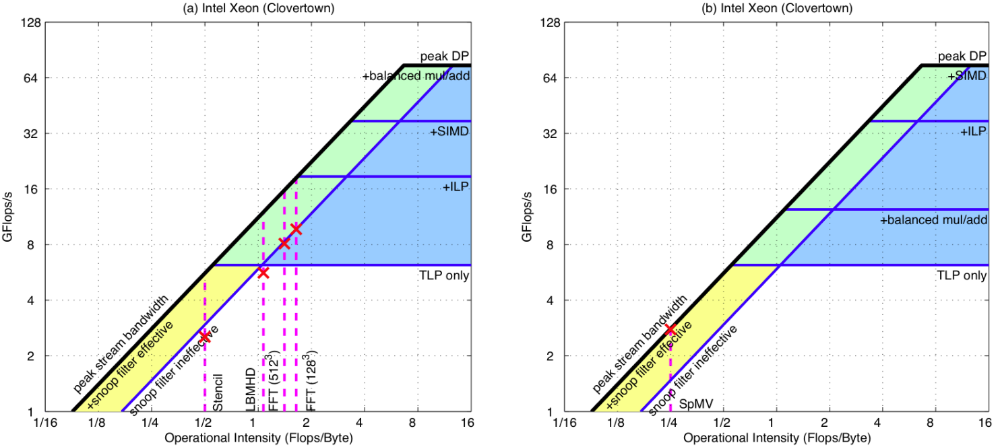

第一，Intel Xeon 的 peak performance 最高，但它的 ridge也高达 6.7。这意味着必须达到至少 6.7 FLOP/Byte，这对很多低 operational intensity 的kernel来说很难。

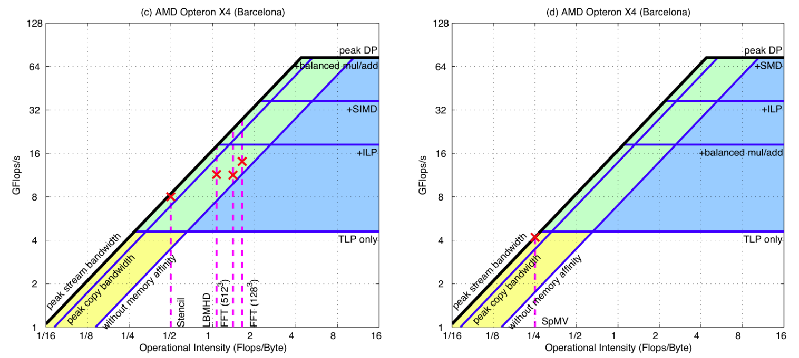
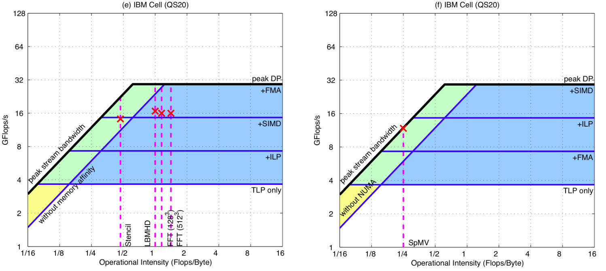
第二，Opteron X4 的 ridge是 4.4，比 Xeon 低一些，但仍然较高。相比之下，Sun T2+ 的 ridge只有 0.33，因为它有很高的内存带宽，Cell 的 ridge是 0.65，也比较低。

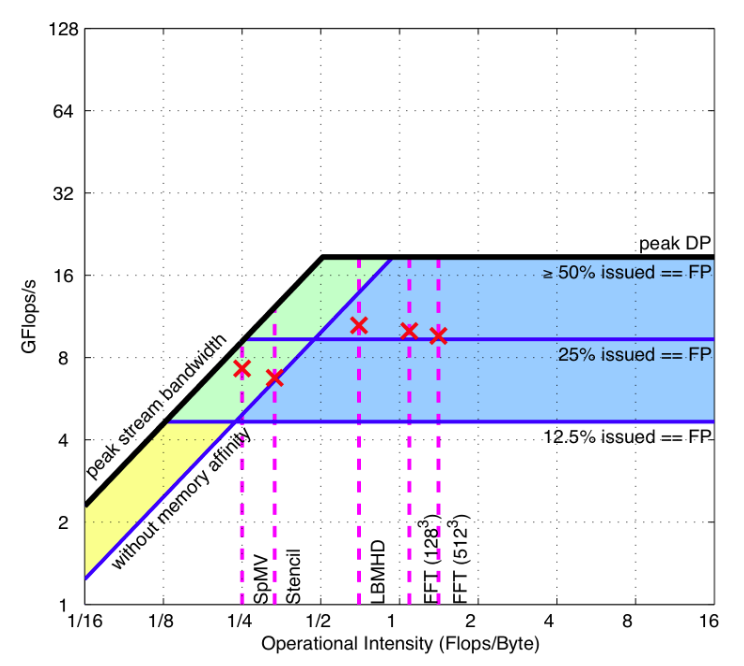

第三，SpMV 的 operational intensity 只有 0.17 到 0.25，低于所有四台机器的 ridge。因此 SpMV 在所有平台上主要是 memory-bound，优化重点主要是内存系统。

### 9.2 Table 3：实际优化项验证 ceilings 的指导意义

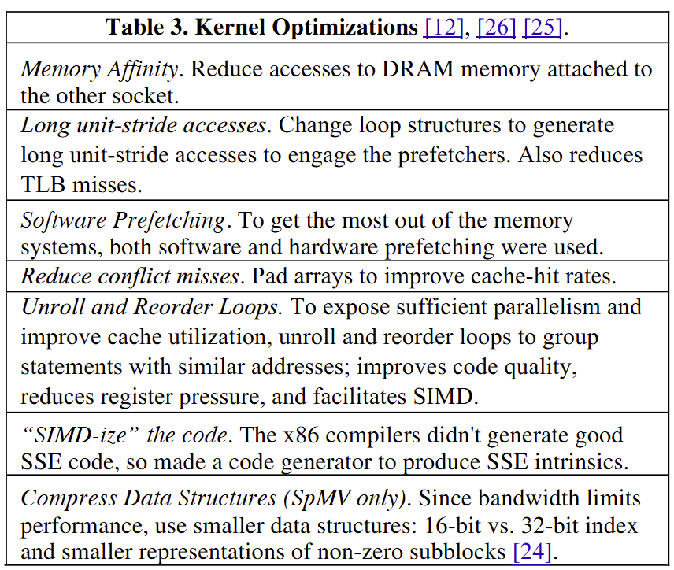

Table 3 总结了作者对 kernel 使用的优化，包括：

* Memory Affinity：减少访问另一个 socket 所连接的远端 DRAM
* Long unit-stride accesses：改变循环结构，产生连续地址访问
* Software Prefetching：提前把未来要用的数据取入 cache，隐藏内存延迟
* Reduce conflict misses：通过 padding 提高 cache hit rate；
* Unroll and Reorder Loops：循环展开与重排序，提高并行性、改善 cache 利用；
* SIMD-ize the code：使用 SSE intrinsics，SSE指令属于Intrinsics函数，由编译器在编译时直接在调用处插入代码，避免了函数调用的额外开销。内在函数（Intrinsic Functions） 是由编译器直接提供的、与特定硬件指令绑定的特殊函数。它允许在 C/C++ 等高级语言中直接调用底层 CPU 指令（如 SIMD、原子操作等），无需编写内联汇编，即可获得接近汇编的性能优化效果。
* Compress Data Structures：在 SpMV 中压缩 index 和非零块表示，减少带宽压力。

这些优化与前面 Figure 2 的 ceilings 一一对应，说明 ceiling 不只是图上的装饰，而是可以具体指导优化。

### 9.3 Table 4：16 个组合验证模型有效性

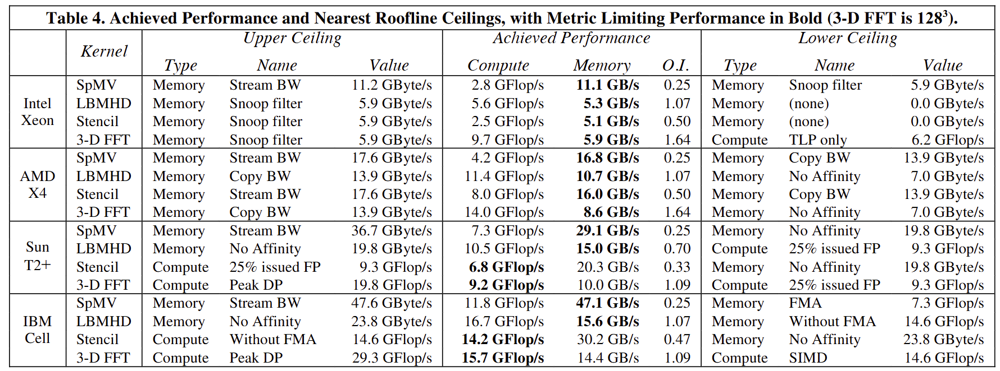

作者用 4 个 kernel 4 台机器，共 16 个组合验证 Roofline。Table 4 给出了每个组合的 upper ceiling、achieved performance、memory bandwidth、operational intensity 和 lower ceiling。作者总结说，所有 16 个案例都验证了这个 bound and bottleneck model，因为实际性能都被相邻的 upper/lower ceilings 包住，并且 kernel 的优化方向也符合 lower ceiling 的提示。

其中一个重要结论是：对于 Xeon 和 Opteron X4，15/16 个 ceilings 是 memory-bound；而对 T2+ 和 Cell 来说，memory-bound 和 compute-bound 更接近平衡。对于 FFT，Xeon 和 X4 上周围 ceilings 是 memory-bound，但在 T2+ 和 Cell 上则更偏 compute-bound。

这说明 Roofline 能解释同一个 kernel 为什么在不同架构上瓶颈不同，也能解释不同架构对同一 workload 的适配程度。

---

## 十、我对这个问题怎么看

不要只看峰值 FLOP/s 或 TOPS。峰值算力只是水平屋顶，如果一个程序的 operational intensity 很低，它根本碰不到水平屋顶，只会撞到斜向的内存带宽屋顶。

这对 AI 加速器研究尤其重要。现在很多加速器论文喜欢强调峰值算力，但 Roofline 告诉我们：如果带宽跟不上，或者 dataflow 没有提高数据复用，那么再多 MAC 单元也可能空转。比如：

* GEMM 和 Conv 的 operational intensity 高，适合 systolic array；
* SpMV、稀疏 attention 的访存不规则，容易 memory-bound；

所以我认为Roofline 对 AI 加速器的启发是设计加速器时不能只问峰值算力有多高，还要知道以下内容：

这个 workload 的 MACs/Byte 是多少？
片上 SRAM 能不能承载足够 tile 复用？
memory bandwidth 能不能喂饱 PE array？
调整dataflow是否可以让ridge向右移动？

## 十一、作者还有哪些不足与未来工作

第一，Roofline不是精确预测模型。它能告诉我们理论上限和主要瓶颈，但不能完整建模所有因素。因此如果要精确预测具体运行时间，还需要结合模拟器、性能计数器等。

第二，论文实验的 kernel 范围有限。作者主要选择了四个kernel代表性很强，但与现代 AI workload 仍然不同。对于AI 加速器，还需要进一步分析 GEMM、Conv、Attention、Softmax、LayerNorm、Embedding、MoE、KV cache、GNN 等算子。